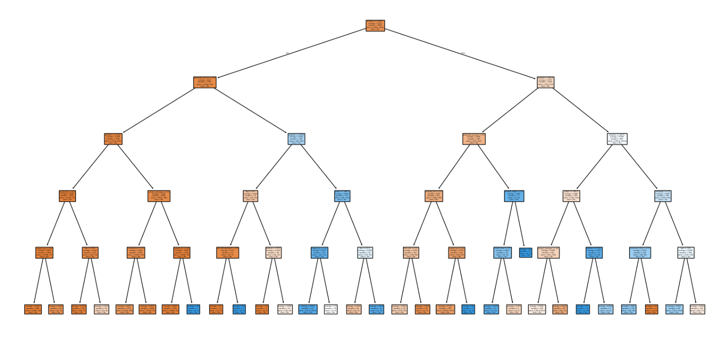
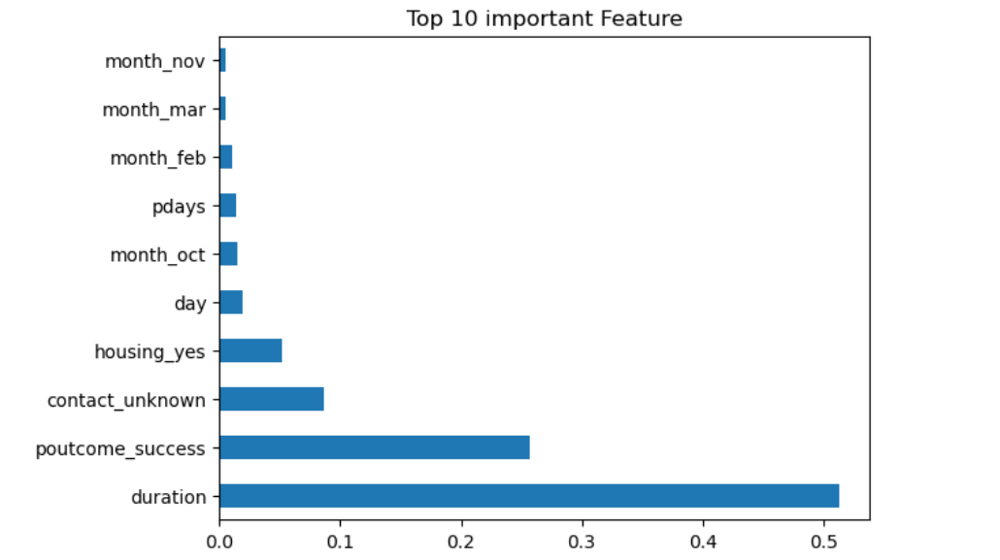

# Decision Tree Classifier – Bank Marketing Dataset

This project implements a Decision Tree Machine Learning model to predict whether a customer will subscribe to a product based on demographic and behavioral attributes.

## Dataset
Source: UCI Machine Learning Repository – Bank Marketing Dataset

## Objective
Predict customer purchase decision (Yes/No).

## Algorithm Used
Decision Tree Classifier

## Steps Performed
- Data preprocessing and encoding
- Feature selection
- Model training and evaluation
- Visualization of Decision Tree
- Feature importance analysis

## Key Insights
- Call duration is the most influential factor.
- Previous campaign success highly impacts purchase decision.
- Housing loan and contact type also play significant roles.

## Decision Tree Visualization

## Feature Importance

## Technologies Used
Python, Pandas, NumPy, Matplotlib, Seaborn, Scikit-learn

## Result
The model successfully classifies customer responses with good accuracy and interpretable results.
